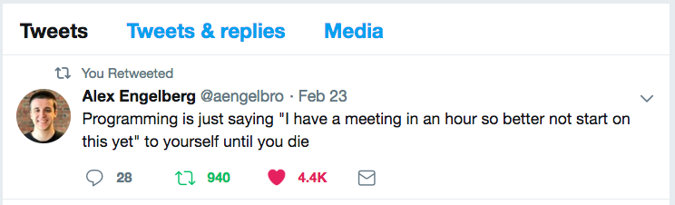

+++
title = "Wise Words | Perle di saggezza"
date = 2018-12-27T00:00:00
draft = false

# # Authors. Comma separated list, e.g. `["Bob Smith", "David Jones"]`.
# authors = []
# 
# # Tags and categories
# # For example, use `tags = []` for no tags, or the form `tags = ["A Tag", "Another Tag"]` for one or more tags.
tags = ["Quotes", "Italian"]
categories = ["Inspiration"]

# Featured image
# To use, add an image named `featured.jpg/png` to your page's folder. 
[image]
  # Caption (optional)
  caption = "Dobbiaco"

  # Focal point (optional)
  # Options: Smart, Center, TopLeft, Top, TopRight, Left, Right, BottomLeft, Bottom, BottomRight
  focal_point = ""
+++

---
+ 23rd of June 2019

> you should choose to enter by the small rivers, and not go right away into the sea, because you should move from easy things to difficult things.

> _(Letter of St. Thomas Aquinas to Brother John on How to Study)_

---
+ 1st of March 2019

> Apri la mente a quel ch’io ti paleso  
e fermalvi entro; ché non fa scïenza,  
sanza lo ritenere, avere inteso.

> _(Dante Alighieri, Divina Commedia, Paradiso V, 40-42)_
  
As beautifully said in the famous *terzina*, there is no real knowledge without "stopping inside" 
and "retaining" what we have heard. Even more so in an age of incessant distraction and information overload.

---
+ 23rd of February 2019

---
+ 28 of February 2017

> "The purpose of models is not to fit the data but to sharpen the questions."

> _(Karlin, Samuel (1923 - ), 11th R A Fisher Memorial Lecture, Royal Society 20, April 1983.)_